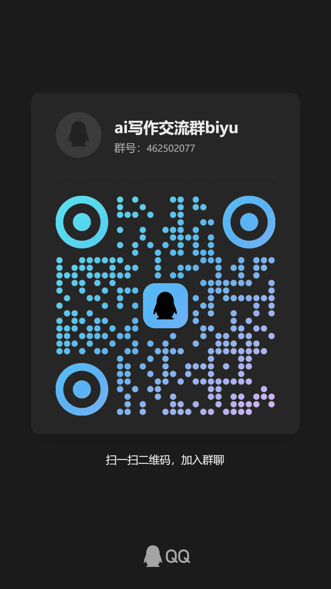

# 笔驭 BiYu

[了解笔驭](https://guge0.github.io/biyu/)

笔驭是面向中文网文连载的本地 AI 创作工作台。它把书籍、设定、章节、声纹、责编讨论和生成流程放在同一个浏览器界面中；书稿保存在你的电脑上，不上传到源码仓库。


## 主要功能

- 管理书籍、章节、世界观和人物卡
- 按细纲生成或续写章节
- 检查前后文一致性、节奏、钩子和人物状态
- 管理声纹样本与本书好句
- 在 Claude Code 中打开本书责编，读取已保存的设定并继续讨论
- 本地保存 API Key、成本记录和书稿版本

## Windows 安装

### 前置条件

1. [Git for Windows](https://git-scm.com/download/win)
2. Python 3.12，并在安装时勾选 **Add Python to PATH**
责编功能还需要 [Claude Code](https://docs.anthropic.com/en/docs/claude-code/overview)。先安装 Node.js，再执行：

```powershell
npm install -g @anthropic-ai/claude-code
claude
```

首次运行 `claude` 时按提示登录。没有安装 Claude Code 时，书架、设定、章节生成等网页功能仍可使用，但“打开责编”不可用。

### 安装笔驭

在 PowerShell 中进入准备存放程序的目录，然后执行：

```powershell
git clone https://github.com/guge0/biyu.git
Set-Location biyu
.\安装笔驭.bat
```

安装器会在仓库内创建独立的 `.venv` 并安装运行依赖；安装过程需要联网。

## 使用

双击仓库根目录的 `start_biyu_ui.bat` 启动：

- 固定打开 `http://127.0.0.1:8080`
- 服务就绪后自动打开浏览器
- 如果同一数据位置的笔驭已经在运行，重复双击只会打开现有页面
- 代码或依赖变化时刷新本地运行包

如果 8080 已被其他程序占用，请先关闭占用该端口的程序，再重新启动笔驭。笔驭不会自动更换端口。

安装时会把作者版的数据位置写入用户配置：

```text
%USERPROFILE%\.biyu\runtime-production.json
```

首次安装会把其中的 `data_root` 设为 `%USERPROFILE%\BiyuData` 并创建目录。以后每次启动都从这个持久文件读取；配置缺失、损坏或指向不存在的目录时会直接报错，不会猜一个默认位置。

不要把书稿目录放进源码仓库。

首次打开书架后，通过“Key / 模型”选择模型并输入服务商 API Key，再点击“保存并校验连接”。连接设置不依赖书籍，可以先配置 Key，再新建或打开书。Key 优先保存在 Windows 系统钥匙串；系统钥匙串不可用时保存到用户目录中的本地加密文件，不写入 Git。

## 模型配置

内置示例包含 DeepSeek、Kimi（Moonshot）、GLM、豆包的配置入口。API Key 通过网页安全存储，不要写入 `config/models.yaml`。

润色默认关闭。重新启用前，请先重新核对润色后的正文，并确认改写结果符合预期。

## 更新

关闭笔驭后，在仓库目录执行：

```powershell
git pull --ff-only
.\安装笔驭.bat
```

然后继续双击 `start_biyu_ui.bat`。书稿目录和源码目录彼此独立，更新代码不会覆盖书稿。

## 备份

自动备份默认关闭。在书架点击“备份”即可选择备份位置、打开自动备份或立即备份一次。打开后笔驭会在启动时备份，并在 Windows 可用时每天凌晨 3:15 备份；错过会在之后补备。

备份只复制有效书目录和根级成本记录，不复制源码、报告或测试输出。保留最近 7 个备份日，并从更早记录中每周留一份，共 4 周。失败原因、上次成功时间、实际备份本数和位置会显示在备份面板。

备份用于防止同机误删和软件损坏，不能替代异机或离线备份。

## 许可

本项目采用 [Biyu 非商业源码许可 1.0](LICENSE)，允许个人和非商业场景使用、修改与分享；商业使用需事先获得版权所有者书面许可。

## 交流

欢迎加入 QQ 群 `462502077` 交流。


