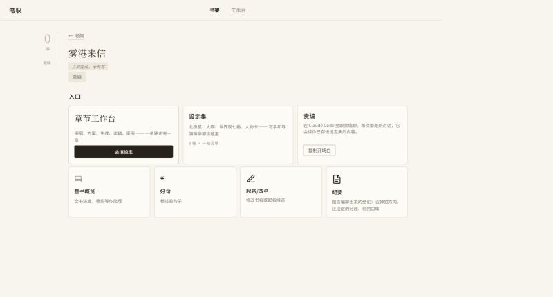

# 笔驭 BiYu

[了解笔驭](docs/index.html)

笔驭是面向中文网文连载的本地 AI 创作工作台。它把书籍、设定、章节、声纹、责编讨论和生成流程放在同一个浏览器界面中；书稿保存在你的电脑上，不上传到源码仓库。

这是一个正在持续完善的个人项目，欢迎通过 GitHub Issues 提交问题、建议和改进想法。




## 主要功能

- 管理书籍、章节、世界观和人物卡
- 按细纲生成或续写章节
- 检查前后文一致性、节奏、钩子和人物状态
- 管理声纹样本与本书好句
- 在 Claude Code 中打开本书责编，读取已保存的设定并继续讨论
- 本地保存 API Key、成本记录和书稿版本

## Windows 安装

### 前置条件

1. [Git for Windows](https://git-scm.com/download/win)
2. Python 3.12，并在安装时勾选 **Add Python to PATH**
3. 能访问本仓库的 GitHub 页面

责编功能还需要 [Claude Code](https://docs.anthropic.com/en/docs/claude-code/overview)。先安装 Node.js，再执行：

```powershell
npm install -g @anthropic-ai/claude-code
claude
```

首次运行 `claude` 时按提示登录。没有安装 Claude Code 时，书架、设定、章节生成等网页功能仍可使用，但“打开责编”不可用。

### 安装笔驭

在 PowerShell 中进入准备存放程序的目录，然后执行：

```powershell
git clone https://github.com/guge0/biyu.git
Set-Location biyu
.\安装笔驭.bat
```

安装器会在仓库内创建独立的 `.venv` 并安装运行依赖。首次安装需要联网。

## 使用

双击仓库根目录的 `start_biyu_ui.bat`。这是唯一的用户启动入口：

- 固定打开 `http://127.0.0.1:8080`
- 服务就绪后自动打开浏览器
- 如果同一数据位置的笔驭已经在运行，重复双击只会打开现有页面
- 如果 8080 上的笔驭使用另一个数据位置，启动器会显示两个位置并拒绝启动，不会终止已有进程，也不会悄悄换端口
- 代码或依赖变化时刷新本地运行包

安装时会把作者版的数据位置写入用户配置：

```text
%USERPROFILE%\.biyu\runtime-production.json
```

首次安装会把其中的 `data_root` 设为 `%USERPROFILE%\BiyuData` 并创建目录。以后每次启动都从这个持久文件读取；配置缺失、损坏或指向不存在的目录时会直接报错，不会猜一个默认位置。

`BIYU_DATA_ROOT` 只用于临时覆盖。设置它后，书架会显眼标明“这次是临时指定的位置”；不要把它作为长期配置。例如仅在当前 PowerShell 窗口临时指定：

```powershell
$env:BIYU_DATA_ROOT = 'D:\MyBiyuBooks'
```

关闭这个 PowerShell 窗口后覆盖即失效。不要把书稿目录放进源码仓库。

首次打开书架后，通过“Key / 模型”选择模型并输入服务商 API Key，再点击“保存并校验连接”。连接设置不依赖书籍，可以先配置 Key，再新建或打开书。Key 优先保存在 Windows 系统钥匙串；系统钥匙串不可用时保存到用户目录中的本地加密文件，不写入 Git。

## 模型配置

内置示例包含 DeepSeek、Kimi（Moonshot）、GLM、豆包的配置入口。API Key 通过网页安全存储，不要写入 `config/models.yaml`。

要增加模型，可以从 `config/models.yaml.example` 复制出被 Git 忽略的 `config/models.yaml`，再填写 provider、模型 ID 和 API 地址。豆包还需要通过 `DOUBAO_ENDPOINT_ID` 提供自己的推理接入点 endpoint ID。接入第五家供应商时，现有适配层不支持的还需新增 adapter 并在模型注册表登记，不能只改下拉配置。

润色默认关闭，作者界面也不提供开关。重新启用前必须同时满足两项：润色后的正文重新跑一次核对，避免核对结果仍指向润色前版本；先用同一段正文做一次真实改前/改后对照，确认结果符合预期。缺任一项都不要开启。

## 更新

关闭笔驭后，在仓库目录执行：

```powershell
git pull --ff-only
.\安装笔驭.bat
```

然后继续双击 `start_biyu_ui.bat`。书稿目录和源码目录彼此独立，更新代码不会覆盖书稿。

## 备份

自动备份默认关闭。在书架点击备份状态，或点击右上角“备份”，即可选择备份位置、打开自动备份或立即备份一次。打开后每次启动笔驭会备份一次，并在 Windows 可用时每天凌晨 3:15 备份；错过会在之后补备。

备份只复制有效书目录和根级成本记录，不复制源码、报告或测试输出。保留最近 7 个备份日，并从更早记录中每周留一份，共 4 周。失败原因、上次成功时间、实际备份本数和位置会显示在备份面板。

备份用于防止同机误删和软件损坏，不能替代异机或离线备份。

## 许可

本项目采用 [Biyu 非商业源码许可 1.0](LICENSE)。你可以阅读、个人使用、学习、修改并在非商业场景分享源码；未经版权所有者书面许可，不得将本项目或其衍生作品用于商业活动、商业服务、销售、付费分发或商业产品的一部分。

这是一份“源码公开但限制商业使用”的许可，不是 OSI 认可的标准开源许可证。若你需要真正意义上的开源（包括商业使用），请改用 MIT、Apache-2.0 等标准许可证。

## 介绍页与交流

项目介绍页位于 [`docs/index.html`](docs/index.html)，也可访问仓库的 GitHub Pages 站点（发布后链接会显示在仓库主页）。

问题和功能建议优先提交到 GitHub Issues。中文用户也可以加入 QQ 群 `462502077` 交流；群内讨论不会替代公开 issue 的记录。
